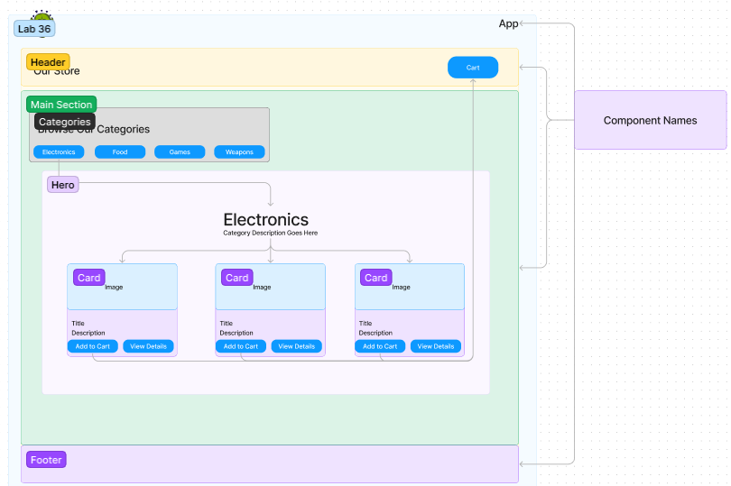

# Todo App

This is a simple todo app built using React that allows users to manage their tasks and keep track of their todos. The application connects to live servers for login, authorization, and data access.

## Author

[Nick Mullaney](https://github.com/nickmullaney) - Lead Developer

## Features

- Add new tasks
- Mark tasks as completed
- Edit existing tasks
- Delete tasks
- Filter tasks based on their completion status (completed or active)

## UML Diagrams

### Lab 36


### Code Sandbox

[Code Sandbox 37](https://codesandbox.io/p/github/nickmullaney/storeApp/cart?layout=%257B%2522sidebarPanel%2522%253A%2522EXPLORER%2522%252C%2522rootPanelGroup%2522%253A%257B%2522direction%2522%253A%2522horizontal%2522%252C%2522type%2522%253A%2522PANEL_GROUP%2522%252C%2522id%2522%253A%2522ROOT_LAYOUT%2522%252C%2522panels%2522%253A%255B%257B%2522type%2522%253A%2522PANEL_GROUP%2522%252C%2522direction%2522%253A%2522horizontal%2522%252C%2522id%2522%253A%2522EDITOR%2522%252C%2522panels%2522%253A%255B%257B%2522type%2522%253A%2522PANEL%2522%252C%2522panelType%2522%253A%2522TABS%2522%252C%2522id%2522%253A%2522cljt719pe00ji356p34b13d1y%2522%257D%255D%252C%2522sizes%2522%253A%255B100%255D%257D%252C%257B%2522type%2522%253A%2522PANEL_GROUP%2522%252C%2522direction%2522%253A%2522horizontal%2522%252C%2522id%2522%253A%2522DEVTOOLS%2522%252C%2522panels%2522%253A%255B%257B%2522type%2522%253A%2522PANEL%2522%252C%2522panelType%2522%253A%2522TABS%2522%252C%2522id%2522%253A%2522cljt719pe00jk356pjxjt3lan%2522%257D%255D%252C%2522sizes%2522%253A%255B100%255D%257D%255D%252C%2522sizes%2522%253A%255B50%252C50%255D%257D%252C%2522tabbedPanels%2522%253A%257B%2522cljt719pe00ji356p34b13d1y%2522%253A%257B%2522tabs%2522%253A%255B%257B%2522id%2522%253A%2522cljt719pe00jh356p3kze3upj%2522%252C%2522mode%2522%253A%2522permanent%2522%252C%2522type%2522%253A%2522FILE%2522%252C%2522filepath%2522%253A%2522%252FREADME.md%2522%257D%255D%252C%2522id%2522%253A%2522cljt719pe00ji356p34b13d1y%2522%252C%2522activeTabId%2522%253A%2522cljt719pe00jh356p3kze3upj%2522%257D%252C%2522cljt719pe00jk356pjxjt3lan%2522%253A%257B%2522tabs%2522%253A%255B%257B%2522id%2522%253A%2522cljt719pe00jj356pc6cpx0ae%2522%252C%2522mode%2522%253A%2522permanent%2522%252C%2522type%2522%253A%2522TASK_PORT%2522%252C%2522taskId%2522%253A%2522dev%2522%252C%2522port%2522%253A5173%252C%2522path%2522%253A%2522%2522%257D%255D%252C%2522id%2522%253A%2522cljt719pe00jk356pjxjt3lan%2522%252C%2522activeTabId%2522%253A%2522cljt719pe00jj356pc6cpx0ae%2522%257D%257D%252C%2522showDevtools%2522%253Atrue%252C%2522showSidebar%2522%253Atrue%252C%2522sidebarPanelSize%2522%253A15%257D)

## Technologies Used

- React
- HTML
- CSS
- JavaScript

## Getting Started

Follow these instructions to get the todo app up and running on your local machine.

1. Clone the repository:

   ```shell
   git clone https://github.com/nickmullaney/todo-app.git
   ```

2. Navigate to the project directory:

   ```shell
   cd todo-app
   ```

3. Install the dependencies:

   ```shell
   npm install
   ```

4. Start the development server:

   ```shell
   npm start
   ```

5. Open your browser and visit `http://localhost:3000` to view the app.

## Usage

- Add a new task by entering a task name and pressing the "Add" button.
- Mark a task as completed by clicking the checkbox next to it.
- Edit a task by clicking the pencil icon and modifying the task name.
- Delete a task by clicking the trash bin icon.
- Use the filter buttons at the top to show all tasks, active tasks, or completed tasks.

## Code Sandbox

- coming soon

## License

This project is licensed under the [MIT License](LICENSE).

### Collaborators

Thanks to Reece, Ike, & Ryan for the collaboration.

Thanks to ChatGPT for assisting with broken code sections and tests.
